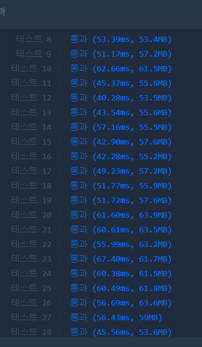
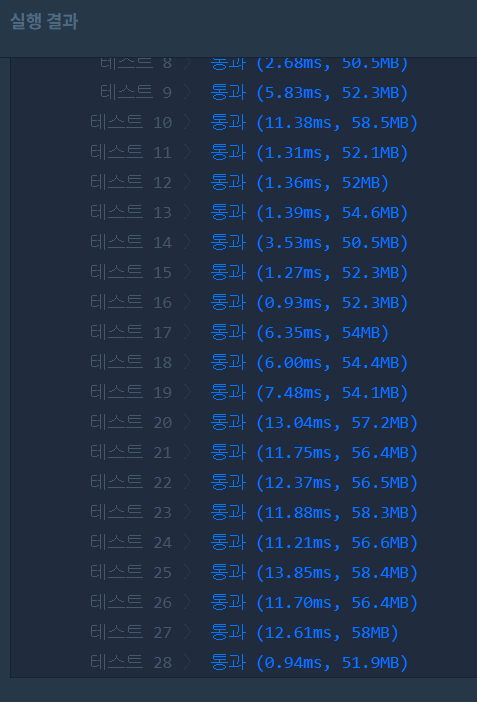
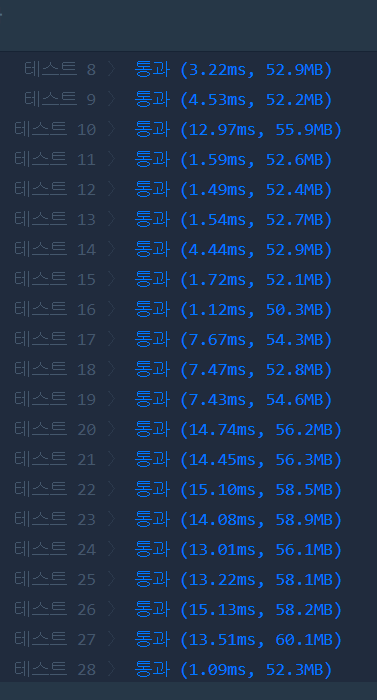

이번 문제를 풀면서, String, StringBuilder, StringBuffer에 대해 속도 비교를 해보았다. (String, StringBuilder, StringBuffer의 개념 설명은 따로 올리겠다.)

먼저 String이다.

그 다음은 StringBuilder이다.

마지막으로 StringBuffer이다.

이렇게 String, StringBuilder, StringBuffer를 비교해 보았을 때,

StringBuilder > StringBuffer > String 순이다.

그 와중에 String이 압도적으로 느린데, 그 이유는 +(append) 할 때마다 새로운 객체를 만들기 때문이다.

StringBuilder와 StringBuffer의 차이는 thread-safe 유무이다.

StringBuilder가 thread-safe하지 않고, StringBuffer는 thread-safe하다.

이 문제가 문자열의 길이가 최대 1000인데, 이 정도 성능 차이를 낼 줄은 몰랐다.

