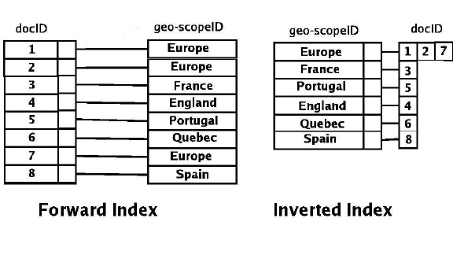

# 역 색인 - Inverted index

**검색 엔진** : '키워드'를 입력 했을 때 '결과'를 찾아 주는 것

수백만개가 쌓여진 Document에서 자신에게 필요한 Document를 찾고자 할 때,

가장 쉬운 방법은 모든 내용과 비교해서 가져오는 방법이다

```sql
SELECT * FROM DOCUMENT WHERE TITLE = 'index';

SELECT * FROM DOCUMENT WHERE TITLE LIKE '%index%';
```


그럼 역 색인이 뭘까?

말 그대로 index를 역으로 하는 거다.

기존 방식은 Primary key가 여러 필드를 지정하고 있었다면, Inverted Index에서는 하나의 값(Term)이 해당 Term이 들어간 document id를 지정한다.

즉, 1번 Document에 A, B, C라는 단어가 있어!! 가 아니라 A라는 단어가 1, 2, 3번 Document에 있고,  B라는 단어가 2번에 있어라는 내용이다.



위의 예제에서 Spain을 검색하면 8번 Docunemt에 존재한다는 것을 알고 주면 된다.

만약 검색단어가 여러개일 때 해당 하는 Document ID를 가져와서 성능에따라 OR나 AND를 통해서 결과값을 전달하면 된다.


## 참고 자료

-  https://needjarvis.tistory.com/345 
-  https://giyatto.tistory.com/2 