# Chapter6. 다양한 연관관계 매핑

연관관계 매핑시 고려해야할 3가지

1. 다중성
   - 다대일(ManyToOne)
   - 일대다(OneToMany)
   - 일대일(OneToOne)
   - 다대다(ManyToMany)
2. 단방향, 양방향
   - 테이블은 외래키 하나로 조인을 사용해서 양방향으로 쿼리(방향성X)
   - 객체는 참조용 필드를 가조있는 객체만 연관된 객체를 조회 가능
3. 연관관계 주인
   - 데이터베이스는 외래키 하나로 연관관계를 관리
   - 엔티티를 양방향으로 매핑하면 A->B, B->A 관리 포인트가 2곳이 되며 이 중 하나를 골라 연관관계 주인으로 설정
   - 주인이 아닌 방향은 외래 키를 변경할 수 없고 읽기만 가능하다
   - 연관관계 주인은 `mappedBy` 속성을 이용하지 않는다.
   - 연관관계 주인이 아니면 `mappedBy` 속성을 사용하고 주인 필드 이름을 값으로 입력


## 6.1 다대일

### 6.1.1 다대일 단방향

다대일 <> 일대다 관계에서 연관관계 주인은 항상 다(N) 쪽이다.

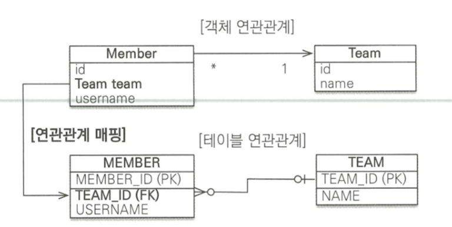

- 회원은 Member.team으로 팀 엔티티를 참조할 수 있다
- 팀에는 회원을 참조하는 필드가 없다.
- 회원과 팀은 다대일 단방향 연관관계다.


### 6.1.2 다대일 양방향 [N:1, 1:N]

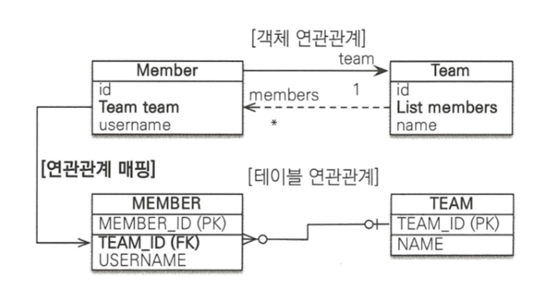

- 양방향 객체 연관관계에서 실선이 연관관계의 주인(Member.team)
- 점선(Team.members)은 연관관계의 주인이 아님

```java
@Entity
public class Member {
	@Id @GeneratedValue
	@Column(name = "MEMBER_ID") 
	private Long id;

    private String username;

    @ManyToOne 
    @JoinColumn(name = "TEAM_ID")
    private Team team;
    
	public void setTeam(Team team) {
        this.team = team;
		//무한루프에 빠지지 않도록 체크 
        if(!team.getMembers().contains(this)){
            team.getMembers().add(this);
        }
    }
}
```

```java
@Entity 
public class Team {
	@Id @GeneratedValue @Column(name = "TEAM—ID")
    private Long id;
	
    private String name;
	
    @OneToMany(mappedBy = "team")
    private List<Member> members = new ArrayList<Member>();

    public void addMember(Member member) { 
        this.members.add(member); 
        if (member.getTeam() != this) { 
            //무한루프에 빠지지 않도록 체크 
            member.setTeam(this);
        }
    }
}
```


- 양방향은 외래 키가 있는 쪽이 연관관계의 주인
  - 일대다, 다대일의 경우 항상 다(N)쪽에 외래키가 있다
  - JPA는 외래키를 관리할 때 연관관계의 주인만 사용
  - 주인이 아닌 Team.members는 조회를 위한 JPQL이나 객체 그래프를 탐색할 때 사용
- 양방향 연관관계는 항상 서로를 참조해야 함
  - 한 쪽만 참조할 경우 연관관계가 성립하지 않음
  - 위의 setTeam, addMember의 경우처럼 항상 서로를 참조하게 하는 메소드를 작성하는 것이 편함
  - 양쪽다 작성할 경우 무한루프에 빠질 수 있음


## 6.2 일대다

엔티티를 하나 이상 참조할 수 있으므로 `Collection, List, Set, Map` 중에 하나를 사용

### 6.2.1 일대다 단방향[1:N]

- 일대다 단뱡항 관계는 JPA2.0부터 지원

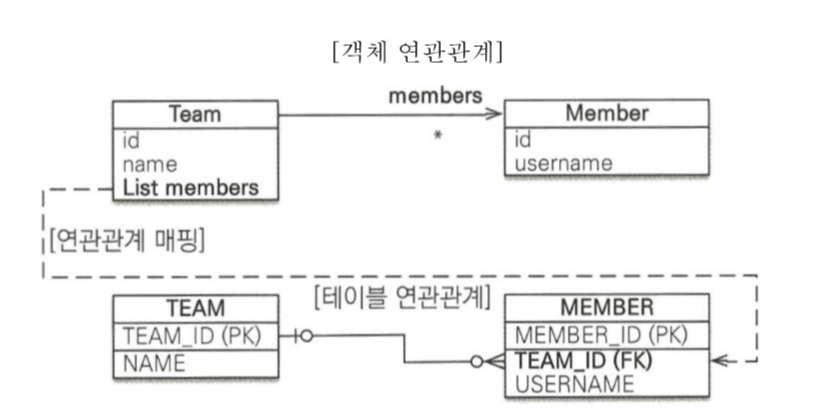

- 그림을 보면 Team.members가 Member 테이블의 TEAM_ID 외래키를 관리
- 이 매핑은 반대쪽 테이블에 있는 외래 키를 관리
- 외래키는 항상 다(N)쪽에 있음


```java
@Entity
public class Team {
	@Id @GeneratedValue 
    @Column(name = "TEAM_ID")
    private Long id;

    private String name;

    @OneToMany @JoinColumn(name = "TEAM_ID") //MEMBER 테이블의 TEAM_ID(FK)
    private List<Member> members = new ArrayList<Member>();
	
    //Getter, Setter ...
}
```

```java
@Entity 
public class Member {
	@Id @GeneratedValue 
    @Column(name = "MEMBER_ID") 
	private Long id;
    
    private String username;
	//Getter, Setter ... 
}
```

- 일대다 단방향 관계를 매핑할 때는 `@JoinColumn` 을 명시
- 명시하지 않을 경우 JPA는 연결 테이블을 중간에 두고 연관관계를 관리하는 조인테이블(JoinTable) 전략을 기본으로 사용해서 매핑(7. 4절에서 설명)

#### 단점

- 매핑한 객체가 관리하는 외래 키가 다른 테이블에 있음
- 본인 테이블에 있으면 `INSERT SQL`로 한번에 처리할 수 있지만 `UPDATE SQL`을 추가로 실행
- 일대다 단뱡항 매핑보다는 다대일 양방향 매핑을 사용하자
  - 성능 문제도 있지만 관리가 부담스러우므로, 다대일 양방향 매핑을 사용하는 것


### 6.2.2 일대다 양방향[1:N, N:1]

- 일대다 양방향 매핑은 존재하지 않음, 더 정확히 말하면 양방향 매핑에서 `OneToMany`는 연관관계의 주인이 될 수 없음
- 다대일 관계는 항상 다(N) 쪽에 외래키가 있기 때문
- 이런 이유로 `ManyToOne`에는 `mappedBy`속성이 없음

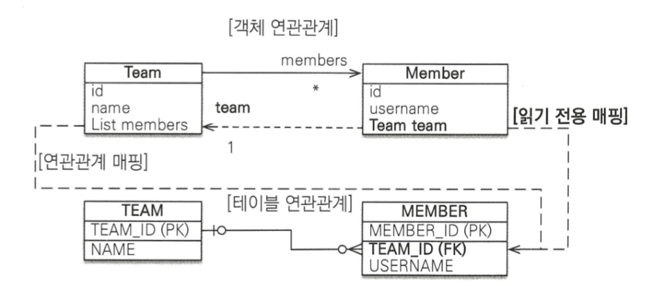


```java
@Entity
public class Team {
	@Id @GeneratedValue 
    @Column(name = "TEAM_ID")
    private Long id;

    private String name;

    @OneToMany @JoinColumn(name = "TEAM_ID")
    private List<Member> members = new ArrayList<Member>();
	
    //Getter, Setter ...
}
```

```java
@Entity 
public class Member {
	@Id @GeneratedValue 
    @Column(name = "MEMBER_ID") 
	private Long id;
    
    private String username;
    
    @ManyToOne
    @JoinColumn(name = "TEAM_ID", insertable = false, updatable = false)
    private Team team;
	//Getter, Setter ... 
}
```

- 둘다 관리하면 문제가 생기므로 Team에 insertable, updatable을 false로 설정해 읽기만 가능하게 한다
- 이러지 말고 그냥 다대일 양방향을 사용하자


## 6.3 일대일[1:1]

### 특징

- 일대일 관계는 그 반대도 일대일 관계
- 테이블 관계에서 일대다, 다대일은 항상 다(N) 쪽이 외래키를 가지지만, 일대일 관계는 주 테이블이나 대상 테이블 둘 중 어느 곳이나 외래키를 가질 수 있음

:star: **주 테이블에 외래 키**

- 주 객체가 대상 객체를 참조하는 것처럼 주 테이블에 외래 키를 두고 대상 테이블을 참조
- 객체지향 개발자들이 선호
- 주 테이블만 확인해도 대상 테이블과 연관관계 파악

:star: **대상 테이블에 외래 키**

- 전통적인 데이터베이스 개발자들 선호
- 테이블 관계를 일대일에서 일대다로 변경할 때 테이블 구조를 그대로 유지


### 6.3.1 주 테이블에 외래 키

#### 단방향

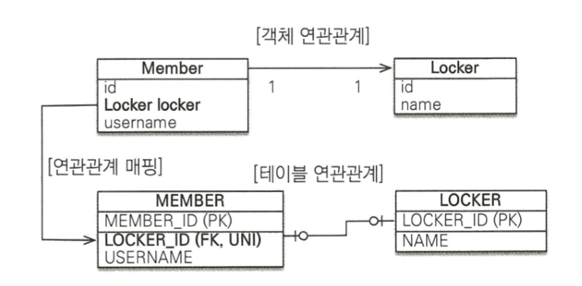

### 

```java
@Entity
public class Member{
    @Id @GeneratedValue
    @Column(name = "MEMBER_ID")
    private Long id;
    
    private String username;
    
    @OneToOne
    @JoinColumn(name = "LOCKER_ID")
    private Locker locker;
    ...
}

@Entity
public class Locker{
    @Id @GeneratedValue
    @Column(name = "LOCKER_ID")
    private Long id;
    
    private String name;
    ...
}
```

- 일대일 관계이므로 `@OneToOne` 사용
- 데이터베이스에는 LOCKER_ID에 대해 UNIQUE 제약 추가
- 다대일 단방향과 비슷


#### 양방향

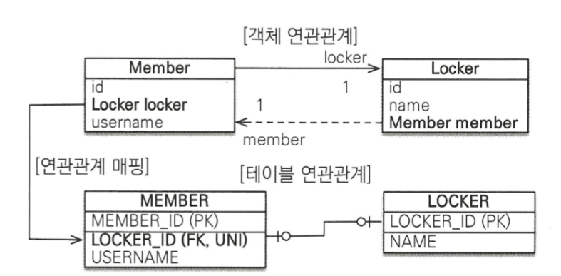

```java
@Entity
public class Member{
    @Id @GeneratedValue
    @Column(name = "MEMBER_ID")
    private Long id;
    
    private String username;
    
    @OneToOne
    @JoinColumn(name = "LOCKER_ID")
    private Locker locker;
    ...
}

@Entity
public class Locker{
    @Id @GeneratedValue
    @Column(name = "LOCKER_ID")
    private Long id;
    
    private String name;
    
    @OneToOne(mappedBy = "locker")
    private Member member;
    ...
}
```

- 양방향이므로 주인관계를 정해야 함
- Member.locker가 주인이므로 Locker.member에 `mappedBy`를 선언하여 주인이 아니라고 설정


### 6.3.2 대상 테이블에 외래 키

#### 단방향

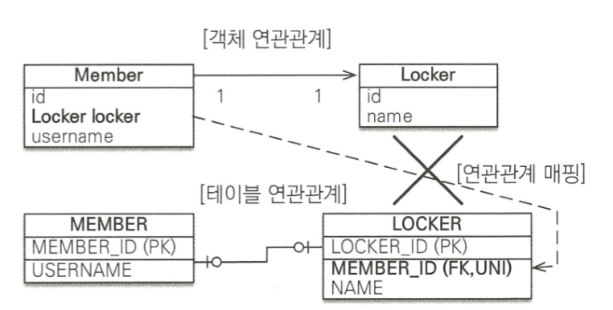

- 일대일 관계 중 대상 테이블에 외래키가 있는 단방향 관계는 JPA에서 지원하지 않음
- 이 때는 Locker에서 Member로의 방향으로 수정하거나 양방향 관계로 만들고 Locker를 연관관계의 주인으로 설정


#### 양방향

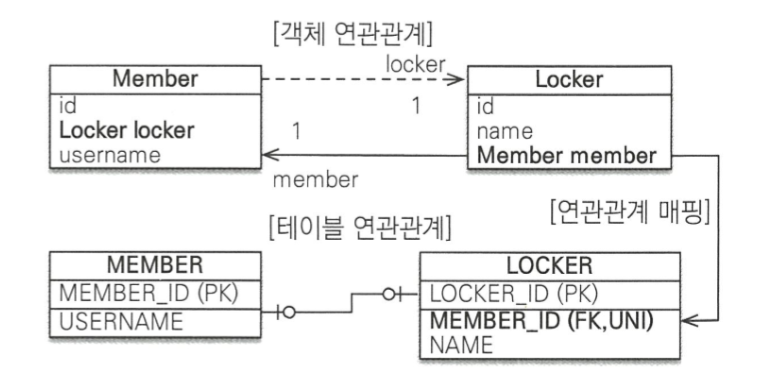

```java
@Entity
public class Member{
    @Id @GeneratedValue
    @Column(name = "MEMBER_ID")
    private Long id;
    
    private String username;
    
    @OneToOne(mappedBy = "member")
    private Locker locker;
    ...
}

@Entity
public class Locker{
    @Id @GeneratedValue
    @Column(name = "LOCKER_ID")
    private Long id;
    
    private String name;
    
    @OneToOne
    @JoinColumn(name = "MEMBER_ID")
    private Member member;
    ...
}
```


> **주의**
>
> 프록시를 사용할 때 외래 키를 직접 관리하지 않는 일대일 관계는 지연 로딩으로 설정해도 즉시 로딩된다.
>
> Locker.member는 지연 로딩할 수 있지만, Member.locker는 지연 로딩으로 설정해도 즉시 로딩된다.
>
> 이것은 프록시의 한계 때문에 발생하는 문제인데 프록시 대신에 bytecode instrumentation을 사용하면 해결할 수 있다. 프록시와 지연 로딩을 이해 못해도 8장에서 설명


## 6.4 다대다[N:N]

- 정규화된 테이블 2개로 다대다 관계를 표현할 수 없음
- 그래서 보통 다대일, 일대다 관계로 풀어낸다

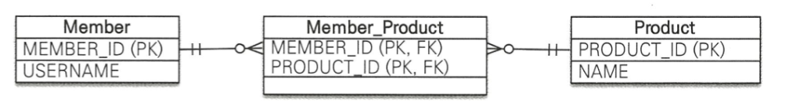

- 그런데 객체는 다대다 관계를 표현할 수 있다.


### 단방향

```java
@Entity
public class Member {
    @Id @Column(name = "MEMBER_ID")
    private String id;

   	private String username;

    @ManyToMany @JoinTable(name = "MEMBER_PRODUCT",
                           joinColumns = @JoinColumn(name = "MEMBER_ID"),
                           inverseJoinColumns = @JoinColumn(name = "PRODUCT_ID")) 
    private List<Product> products = new ArrayList<Product>();
    ...
}
```

```java
@Entity
public class Product{
    @Id @Column(name = "PRODUCT_ID")
    private String id;
    private String name;
    ...
}
```

- `@ManyToMany`와 `@JoinColumn`을 사용해서 연결 테이블을 바로 매핑

- 회원과 상품을 연결하는 회원_상품(MEMBER_PRODUCET) 엔티티 없이 매핑을 완료할 수 있음

- MEMBER_PRODUCT 테이블은 다대다 관계를 일대다, 다대일 관계로 풀어내기 위한 연결 테이블이다

- @ManyToMany 매핑덕분에 연결테이블을 신경쓰지 않아도 된다.

  

:star: **@JoinTable** 속성

- @JoinTable.name : 연결 테이블 지정, 여기서는 MEMBER_PRODUCT
- @JoinTable.joinColumns : 현재 방향인 회원과 매핑할 조인 컬럼 정보를 지정, 여기서는 MEMBER_ID
- @JoinTable.inverseJoinColumns : 반대 방향인 상품과 매핑할 조인 컬럼 정보 지정, 여기서는 PRODUCT_ID


#### SAVE

```java
public void save() {
    Product productA = new Product(); 
    productA.setld("productA");
    productA.setName("상품A");
    em.persist(productA);
    
	Member member1 = new Member(); 
    member1.setld("member1"); 
    member1.setUsername("회원1");
    member1.getProducts().add(productA); //연관관계 설정 
    em.persist(memberl);
	...
}
```

```sql
INSERT INTO PRODUCT ...
INSERT INTO MEMBER ...
INSERT INTO MEMBER_PRODUCT ...
```


#### FIND

```java
public void find () {
    Member member = em.find(Member.class, "memberl");
    List<Prociuct> products = member.getProducts(); //객체 그래프 탐색
    for (Product product : products) { 
        System.out.printin("product.name = " + product.getName());
    }
}
```

```SQL
SELECT * FROM MEMBER_PRODUCT MP 
INNER JOIN PRODUCT P ON MP.PRODUCT_ID=P.PRODUCT_ID 
WHERE MP.MEMBER_ID=?
```


### 양방향

```java
@Entity
public class Product{
    @Id @Column(name = "PRODUCT_ID")
    private String id;
    private String name;
    
    @ManyToMany(mappedBy = "products")
    private List<Member> members;
    ...
}
```

- 양방향 관계는 이전 예제처럼 메소드 안에서 연관관계를 관리해주는 것이 좋음

### 

### 다대다 : 매핑의 한계와 극복, 연결 엔티티 사용

- 연결 테이블을 자동으로 처리해주어 편리하지만 실무에 사용하기엔 무리가 있음
- 보통은 연결 테이블에 주문 수량, 주문 일자가 더 필요

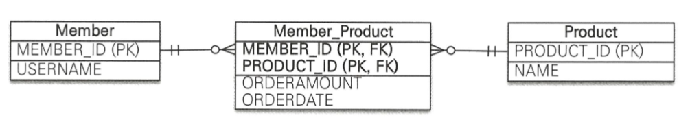

- 이렇게 필드를 더 추가하면 ManyToMany를 사용할 수 없음
- 다시 일대다, 다대일 엔티티로 풀어 내야함

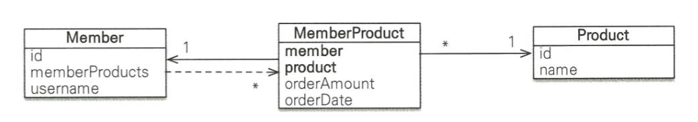


```java
@Entity
public class Member{
    @Id @Column(name = "MEMBER_ID")
    private String id;
    private String username;
    
    @OneToMany(mappedBy = "member")
    private List<MemberProduct> memberProducts;
    ...
}
```

```java
@Entity
public class Product{
    @Id @Column(name = "PRODUCT_ID")
    private String id;
    private String name;
    ...
}
```

```java
@Entity
@IdClass(MemberProductId.class)
public class MemberProduct{
	@Id
    @ManyToOne
    @JoinColumn(name = "MEMBER_ID")
    private Member member;
    
    @Id
    @ManyToOne
    @JoinColumn(name = "PRODUCT_ID")
    private Product product;
    
    private int orderAmount;
    ...
}
```

```java
public class MemberProductId implements Serialiable {
    private String member; //MemberProduct.member와 연결
    private String product; //MemberProduct.product와 연결
    
    @Override
    public boolean equals(Object o){...}
    
    @Override
    public int hashCode(){..}
}
```

- @Id와 외래키를 매핑하는 @JoinColumn을 동시에 사용해서 기본키 + 외래키를 한번에 매핑
- @IdClass를 사용해서 복합 기본키를 매핑

> **복합 기본 키**
>
> 회원상품 엔티티는 MEMBER_ID + PRODUCT_ID로 이루어진 복합 기본키(이하 복합키), JPA에서 복합키를 사용하려면 별도의 식별자 클래스를 만들어야 한다. 그리고 @IdClass를 사용해서 식별자 클래스를 지정
>
> 특징
>
> - 복합 키는 별도의 식별자 클래스로 만듦
> - Serializable을 구현
> - equals와 hashcode 구현
> - 기본 생성자
> - 식별자 클래스는 public
> - @IdClass를 사용하는 방법 외에 @EmbeddedId를 사용하는 방법도 있음


#### SAVE

```java
public void save() {
//회원 저장
    Member member1 = new Member();
    member1.setld("member1"); 
    member1.setUsername("회원 1"); 
    em.persist(memberl);
    
//상품 저장 
    Product productA = new Product(); 
    productA.setld("productA"); 
    productA.setName("상품 1");
    em.persist(productA);
    
//회원상품 저장 
    MemberProduct memberProduct = new MemberProduct(); 
    memberProduct.setMember(memberl); //주문 회원 - 연관관계 설정 
    memberProduct.setProduct(productA); //주문 상품 - 연관관계 설정 
    memberProduct.setOrderAmount(2); //주문 수량
	em.persist(memberProduct); 
}
```

#### FIND

```java
public void find () {
	//기본 키 값 생성 
    MemberProductld memberProductId = new MemberProductId(); 
    memberProductld.setMember("member1"); 
    memberProductld.setProduct("productA");
    
    MemberProduct memberProduct = em.find(MemberProduct.class, memberProductld);
    Member member = memberProduct.getMember(); 
    Product product = memberProduct.getProduct();
	
    System.out.println("member = " + member.getUsername()); 
    System.out.println("product = " +product.getName()); 
    System.out.printIn("orderAmount = " + memberProduct.getOrderAmount());
}
```

- 복합 키는 항상 식별자 클래스를 만들어야 한다.
- em.find()를 보면 생성한 식별자 클래스로 엔티티를 조회한다.
- 복합키를 사용할 경우 처리할 일이 많아진다.(식별자 클래스 만들기, @IdClass 또는 @EmbbeddedId 사용, equals/hashCode 구현 등)


### 다대다 : 새로운 기본 키 사용

- 복합키를 사용하지 않고 데이터베이스에서 자동으로 생성해주는 대리키를 Long값으로 지정하는 방법

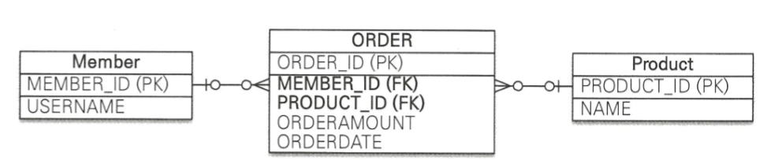

```java
@Entity
public class ORDER{
	@Id @GeneratedValue
    @Column(name = "ORDER_ID")
    private Long id;
    
    @ManyToOne
    @JoinColumn(name = "MEMBER_ID")
    private Member member;
   
    @ManyToOne
    @JoinColumn(name = "PRODUCT_ID")
    private Product product;
    
    private int orderAmount;
    ...
}
```

- 저장은 똑같이 저장할 수 있고, 검색의 경우 복합키를 만들어서 조회하는 것이아니라 orderId(Long)으로 조회할 수 있음


### 정리

- 다대다 관계를 일대다 다대일 관계로 풀어내기 위해 연결 테이블을 만들 때 식별자를 어떻게 구성할지 선택
  - 식별 관계 : 받아온 식별자를 기본 키 + 외래 키로 사용
  - 비식별 관계 : 받아온 식별자는 외래 키로 사용하고 새로운 식별자 추가
- 객체 입장에서는 비식별 관계가 클래스를 생성하지 않고, 단순하므로 추천한다

