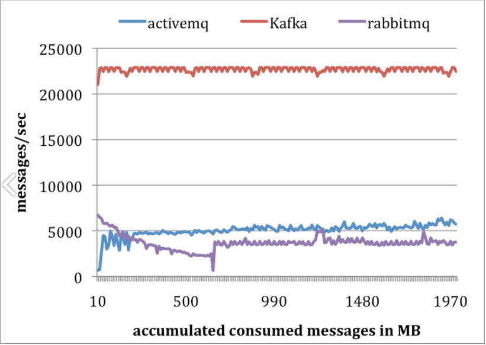

# Rabbit MQ(Message Queue)

메시지 큐를 사용하는 이유에 대해 먼저 알아보자

## 메시지 큐란

- 대용량 데이터를 처리하기 위한 배치 작업이나, 채팅 서비스, 비동기 데이터를 처리할 때 사용
- 데이터가 많아지면 요청에 대한 응답이 길어지는데, 데이터 처리 부분을 분산시켜 작업하는 방법

### 메시지 큐의 특징

1. 비동기(Asynchronous) : Queue에 넣고 다른 일을 처리함
2. 비동조(Decoupling) : Application과 분리
3. 탄력성(Resilience) : 실패가 전체로 퍼지지 않음
4. 과잉(Redundancy) : 실패시 재실행 가능
5. 보증(Guarantees) : 작업이 무조건 일어남
6. 확장성(Scalable) : 다수의 프로세스가 큐에 메시지를 보냄

### 메시지 큐의 사용

- Message를 많은 사람들에게 전달하고 싶을 때
- Application간 결합도를 낮추고 싶을 때

## Rabbit MQ란

- AMQP(Advanced Message Queuing Protocol)을 구현한 Messasge Broker
- Cluster 구성이 쉽고, Management UI가 기본으로 제공된다.
- 다양한 Plugin이 제공된다.
- Spring에서도 AMQP 연동 라이브러리가 존재한다.
- 소비자 중심의 설계이며, 20K/sec 처리가 보장된다

### 

### VS Kafka 특징

- 구동 방식의 비동기식 구성
- 고성능 고가용성
- 분산처리에 효과적으로 설계
- 생산자 중심의 설계
- 100k/sec

  

## Rabbit MQ의 구성요소

- 프로듀서(Producer) : Message를 생산하는 주체
- 브로커(Broker) :
- 컨슈머(Consumer) : Message를 소비하는 주체

}

## Exchanges

다른 Queue에게 Routing 하는 역할을 담당

- Direct Exchange(Unicast)
  - Message의 Routing Key와 정확히 일치하는 Binding된 Queue로 Routing
- Fanout Exchange(Broadcast)
  - Binding된 모든 Queue에 Message를 Routing
- Topic Exchange(Multicast)
  - 특정 Routing Pattern이 일치하는 Queue로 Routing
- Headers Exchange(Multicast)
  - Key-Value로 정의된 Header 속성을 통한 Routing

### 기타 설정값

- Durability

  브로커가 재시작 될 때 남아 있는지 여부

  - durable : 재시작해도 유지 가능
  - transient : 재시작하면 사라짐

- Audo-delete

  마지막 Queue 연결이 해제되면 삭제

:star: <u>Broadcast: 모든 네트워크에 전송하는 방식, Multicast : 보내고자하는 그룹 네트워크에 전송하는 방식, Unicast : 1:1 전송 방식</u>

## 참고 자료

- https://ellune.tistory.com/29 
- https://cheese10yun.github.io/spring-rabbitmq/ 
- [https://velog.io/@hellozin/Spring-Boot%EC%99%80-RabbitMQ-%EC%B4%88%EA%B0%84%EB%8B%A8-%EC%84%A4%EB%AA%85%EC%84%9C](https://velog.io/@hellozin/Spring-Boot와-RabbitMQ-초간단-설명서) 
- https://nesoy.github.io/articles/2019-02/RabbitMQ 
- https://skibis.tistory.com/310 