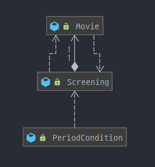
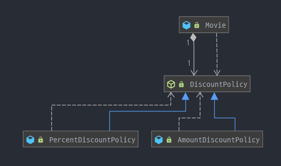

# 의존성 관리하기

## 의존성 이해하기

### 변경과 의존성

- 실행시점 : 의존하는 객체가 정상적으로 동작힉 위해서는 실행 시에 의존 대상 객체가 반드시 존재
- 구현시점 : 의존 대상 객체가 변경될 경우 의존하는 객체도 함꼐 변경

```JAVA
public class PeriodCondition implements DiscountCondition {
    private DayOfWeek dayOfWeek;
    private LocalTime startTime;
    private LocalTime endTime;

    public PeriodCondition(DayOfWeek dayOfWeek, LocalTime startTime, LocalTime endTime) {
        this.dayOfWeek = dayOfWeek;
        this.startTime = startTime;
        this.endTime = endTime;
    }

    public boolean isSatisfiedBy(Screening screening) {
        return screening.getStartTime().getDayOfWeek().equals(dayOfWeek) &&
                startTime.compareTo(screening.getStartTime().toLocalTime()) <= 0&&
                endTime.compareTo(screening.getStartTime().toLocalTime()) >= 0;
    }
}

```

- 실행 시점에 Screening의 인스턴스가 존재 해야한다.
- 객체가 예정된 작업을 정상적으로 수행하기 위해 다른 객체를 필요로 하는 경우 두 객체 사이에 <u>의존성</u>이 있다고 한다.
- 의존성은 변경에 의한 영향의 전파 가능성을 암시한다.

### 의존성 전이(Transitive dependency)

- PeriodCondition이 Screening에 의존할 경우 Screening이 의존하는 대상에도 의존하게 된다는 것



- PeriodCondition은 Movie를 간접 의존 하고있다.

**직접의존성** : 한 요소가 다른 요소에 직접 의존하는 경우

**간접의존성** : 직접적인 관계는 존재하지 않지만 의존성 전이에 의해 영향이 전파되는 경우

### 런타임 의존성과 컴파일타임 의존성

- 런타임 의존성(run-time dependency) : 애플리케이션이 실행되는 시점
- 컴파일타임 의존성(compile-time dependency) : 작성된 코드를 컴파일하는 시점을 가리키지만 문맥에 따라서는 코드 그 자체

**런타임 의존성과 컴파일타임 의존성이 다를 수 있다.**

유연하고 재사용 가능한 코드를 설계하기 위해서는 두 종류의 의존성을 서로 다르게 만들어야 한다.

예제)



Movie의 경우 컴파일 타임에는 DiscountPolicy에 의존하지만, 런타임 의존성에는 AmountDiscountPolicy나 PercentDiscountPolicy에 의존한다.

- 유연하고 재사용 가능한 설계를 창조하기 위해서는 동일한 소스코드 구조를 가지고 다양한 실행 구조를 만들 수 있어야 한다.
- 다양한 클래스의 인스턴스와 협력하기 위해서는 협력할 인스턴스의 구체적인 클래스를 알아서는 안 된다.
- 실제로 협력할 객체가 어떤 것인지는 런타임에 해결해야 한다.

### 컨텍스트 독립성

클래스가 사용될 특정한 문맥에 대해 최소한의 가정만으로 이뤄져 있다면 다른 문맥에서 재사용하기 수월해진다.

각 객체가 해당 객체를 실행하는 시스템에 관해 아무것도 알지 못한다는 의미

**의존성 해결**

1. 객체를 생성하는 시점에 생성자를 통해 의존성 해결

   ```JAVA
   Movie starWars = new Movie("스타워즈",
                              Duration.ofMinutes(180),
                              Money.wons(11000),
                              new PercentDiscountPolicy(...)
   	);
   ```

   

2. 객체 생성 후 setter 메서도를 통해 의존성 해결

   1. 실행 시점에 의존 대상 변경 가능하기 떄문에 조금 더 유연
   2. 객체를 생성하고 의존 대상을 설정하기 전까지는 불안정할 수 있음

   ```JAVA
   avatar.setDiscountPolicy(new AmountDiscountPolicy(...));
   ```

   

3. 메서드 실행 시 인자를 이용해 이존성 해결

   1. 협력 대상에 대해 지속적으로 의존 관계를 맺을 필요 없이 메서드가 실행되는 동안만 일시적으로 의존 관계가 존재해도 무방하거나, 메서드가 실행될 때마다 의존 대상이 매번 달라져야 하는 경우

## 유연한 설계

### 의존성과 결합도

객체지향 패러다임의 근간은 협력

Movie와 PercentDiscountPolicy와의 협력은 필요하다. 하지만, 다양한 할인 정책이 필요할 때마다 의존성을 추가해 줘야한다. 따라서, DIscountPolicy라는 것을 만들고 Movie에 의존시킨다.

의존성 자체는 나쁜게 아니다. 단지 바람직하지 못한 의존성이 문제일 뿐이다.

<u>**바람직한 의존성은 다양한 환경에서 재사용이 가능한 것이다.(컨텍스트 독립적이다.)**</u>

느슨한 결합도(loose coupling) == 약한 결합도(weak coupling) <-> 단단한 결합도(tight coupling) == 강한 결합도(String coupling)


### 자식이 결합도를 낳는다.

서로에 대해 알고 있는 지식의 양이 결합도를 결정한다.

Movie의 경우 DIscountPolicy에 의존하는 것이 PercentDiscountPolicy에 의존하는 것보다 더 적은 지식을 요구한다.

더 많이 알고 있다는 것은 더적은 컨텍스트에서 재사용이 가능하다는 것을 의미한다.

**<u>추상화를 사용하자</u>**

### 추상화에 의존하라.

<u>추상화</u>란 어떤 양상, 세부사항, 구조를 좀 ㅓㄷ 명확하게 이해하기 위해 특정 절차나 물체를 의도적으로 생략하거나 감춤으로써 복잡도를 극복하는 방법

다음 목록에서 아래쪽으로 갈수록 클라이언트가 알아야 하는 지식의 양이 적어지기 때문에 결합도가 느슨해진다.

- 구체 클래스 의존성(concrete class dependency)
- 추상 클래스 의존성(abstract class dependency)
- 인터페이스 의존성(interface dependency)

인터페이스에 의존하면 상속 계층을 모르더라도 협력이 가능해진다.

### 명시적인 의존성

앞에서 설명한 것처럼 생성자, setter, 메서드 인자를 사용해서 의존성을 해결할 수 있다.

```java
public Movie(String title, Duration runningTime, Money fee, DiscountPolicy discountPolicy) {
    this.title = title;
    this.runningTime = runningTime;
    this.fee = fee;
    this.discountPolicy = discountPolicy;
}
```

의존성의 대상을 생성자의 인자로 전달받는 방법과 생성자 안에서 직접 생성하는 방법 사이의 가장 큰 차이점은 퍼블릭 인터페이스를 통해 할인 정책을 설정할 수 있는 방법을 제공하는지 여부다.(setter, 메서드 인자도 마찬가지)

**명시적인 의존성** : 모든 경우에 의존성은 퍼블릭 인터페이스에 노츨된다.

**숨겨진 의존성** : 의존성이 퍼블릭 인터페이스에 조출되지 않는 경우.

의존성이 명시적이지 않으면 의존성 파악을 위해 내부구현을 볼 수 밖에 없다. -> 고통

의존성은 나쁜게 아니다. 숨기는게 나쁜거지 그니까 숨기지 좀 말고 드러내서 알려라. 그러면 유연하고 재상 가능해진다.

### new는 해롭다

클래스의 인스턴스를 생성하는 new 연산자는 안타깝게도 잘못 사용할 경우 결합도가 극단적으로 높아진다.

- new 연산자를 상ㅇ하기 위해서는 구체 클래스의 이름을 직접 기술해야 한다. 따라서 new를 사용하는 클라이언트는 추상화가 아닌 구체 클래스에 의존할 수 밖에 없기 때문에 결합도가 높아진다.
- new 연산자는 생성하려는 구체 클래스를뿐만 아니라 어떤 인자를 이용해 클래스의 생성자를 호출해야 하는지도 알아야 한다. 따라서 new를 사용하면 클라이언트가 알아야 하는 지식의 양이 늘어나기 때문에 결합도가 높아진다.

<u>구체 클래스에 직접 의존하면 의존성이 높아진다는 사실을 기억하자</u>

new는 구체 클래스에 결합하는 것으로 끝나지 않는다. 협력할 클래스의 인스턴스를 생성하기 위해 어떤 인자들이 필요하고 그 인자들을 어떤 순서로 사용해야하는지에 대한 정보도 노출한다.

해결 방법은? 인스턴스를 생성하는 로직과 생성된 인스턴스를 사용하는 로직을 분리하는 것이다. (사용과 생성의 책임분리)

### 가끔은 생성해도 무방하다.

클래스 안에서 객체의 인스턴스를 직접 생성하는 방식이 유용한 경우도 있다. 주로 협력하는 기본 객체를 설정하고 싶은 경우

예를 들어, AmountDiscountPolicy와 주로 협력하고 가끔 PercentDiscountPolicy와 협력한다고 가정하자. 생성의 책임을 client로 넘긴다면 클라이언트들에서 중복코드가 늘어날 것이다.

해결방법은 기본 객체를 생성하는 생성자를 추가하고 이생성자에서 DIscountPolicy의 인스턴스를 인자로 받는 생성자를 체이닝 하는것이다.

```java
public class Movie{
    private DiscountPolicy discountPolicy;
    
    public Movie(String title, Duration runningTime){
        this(title, runningTime, new AmountDiscountPolicy(...));
    }
    
    public Movie(String title, Duration runningTime, DiscountPolicy discountPolicy){
        ...
        this.discountPolicy = discountPolicy;    
    }
}
```

이 예는 설계가 트레이드오프 활동이라는 사실을 다시 한번 상기시킨다.


### 표준 클래스에 대한 의존은 해롭지 않다.

변경될 확률이 거의 없는 클래스라면 의존성이 문제가 되지 않는다. JDK에 포함된 표준 클래스가 이 부류에 속한다.

ArrayList의 경우에는 직접 생성해서 대입하는 것이 일반적이다. ArrayList가 수정될 확률은 0에 가깝기 떄문

비록 클래스를 직접 생성하더라도 추상타입을 사용하자 ArrayList -> List

### 

### 컨텍스트 확장하기

첫번째 예제,

```java
public class Movie{
    private DiscountPolicy discountPolicy;
    
    public Movie(String title, Money fee, Duration runningTime){
        this(title, runningTime, fee, null);
    }
    
    public Movie(String title, Duration runningTime, Money fee, DiscountPolicy discountPolicy){
        ...
        this.discountPolicy = discountPolicy;    
    }
    
    public Money calculateMovieFee(Screening screening){
        if(discountPolicy == null){
            return fee;
        }
        
        return fee.minus(discountPolicy.calculateDiscountAmount(screening));
    }
}
```

null인지 체크하는 경우 Movie와 DIscountPolicy 사이에 예외 케이스가 추가된 것이다. 이 예외케이스를 처리하기 위해 내부코드를 직접 수정했다. 어떤 경우든 내부를 직접 수정하는 것은 버그의 발생 가능성을 높인다.

그래서 이렇게 하지말고 기존에 협력하는 방식으로 만들자.

NoneDiscountPolicy를 만들어 해결하도록 하자.

```java
public class NoneDiscountPolicy extends DiscountPolicy {
    @Override
    protected Money getDiscountAmount(Screening screening) {
        return Money.ZERO;
    }
}
```

두번째 예제,

중복 적용이 가능한 할인 정책을 구현하는 것이다.

가장 간단하게 만드는 것은 List<DiscountPolicy> 겠지만 이는 예외 케이스가 되기 떄문에 적절하지 않고

첫번째 예제처럼 해결하자.

```java
public class OverlappedDiscountPolicy extends DiscountPolicy {
    private List<DiscountPolicy> discountPolicies = new ArrayList<>();

    public OverlappedDiscountPolicy(DiscountPolicy ... discountPolicies) {
        this. discountPolicies = Arrays.asList(discountPolicies);
    }

    @Override
    protected Money getDiscountAmount(Screening screening) {
        Money result = Money.ZERO;
        for(DiscountPolicy each : discountPolicies) {
            result = result.plus(each.calculateDiscountAmount(screening));
        }
        return result;
    }
}
```


이렇게 하면, Movie를 수정하지 않고도 쉽게 원하는 기능을 추가할 수 있다.


### 조합 가능한 행동

어떤 객체와 협력하느냐에 따라 객체의 행동이 잘라지는 것은 유연하고 재사용 가능한 설계가 가진 특징이다.

유연하고 재사용 가능한 설계는 객체가 어떻게(how) 하는지를 장황하게 나열하지 않고도 객체들의 조합을 통해 무엇(what)을 하는지를 표현하는 클래스로 구성된다.

객체가 어떤객체와 연결됐는지를 보는 것만으로 행동을 쉽게 예상하고 이해할 수 있다.

유연하고 재사용 가능한 설계는 작은 객체들의 행동을 조합함으로써 새로운 행동을 이끌어낼 수 있는 설계

훌륭한 객체지향 설계란 객체가 어떻게 하는지를 표현하는 것이 아니라, 객체들이 무엇을 하는지를 표현하는 설계다.
